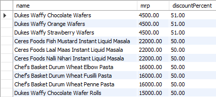
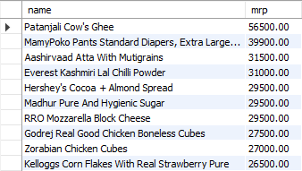
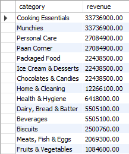
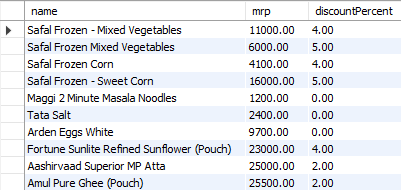
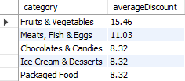
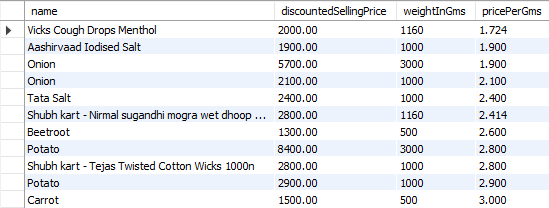
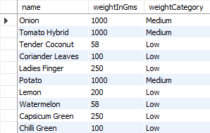
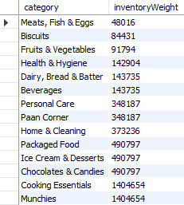

# Zepto Inventory Analysis Using SQL

## Project Overview

This project analyzes Zepto inventory and product data using SQL to uncover insights related to pricing, discounts, stock availability, revenue generation, and inventory management.

The project includes data exploration, data cleaning, and business analysis queries using MySQL.

---

## Tools Used

- MySQL
- CSV Dataset

---

## Dataset Information

The dataset contains inventory-related information including:

- Product Name
- Category
- MRP
- Discount Percentage
- Available Quantity
- Selling Price
- Product Weight
- Stock Availability

---

## Data Cleaning Performed

- Removed products with zero price
- Converted prices from paise to rupees
- Checked for null values
- Identified duplicate product names

---

## Business Problems Solved

### 1. Top 10 Best Value Products
Identified products with the highest discount percentages.

### 2. Expensive Products Out of Stock
Found high-MRP products currently unavailable because they have high margins as well.

### 3. Revenue by Category
Calculated estimated revenue generated by each category.

### 4. Premium Products with Low Discounts
Filtered products with MRP above ₹500 but discounts below 10%.

### 5. Categories with Highest Average Discounts
Identified top categories offering maximum discounts.

### 6. Best Value Products by Weight
Calculated price per gram for products above 100g.

### 7. Product Weight Segmentation
Grouped products into:
- Low
- Medium
- Bulk

### 8. Total Inventory Weight by Category
Calculated total inventory weight for each category.

---

## Key Insights

- Some premium products are frequently out of stock
- Certain categories offer significantly higher discounts
- Weight-based pricing helps identify best-value products

---

## Future Improvements

- Build Power BI dashboard
- Perform customer behavior analysis
- Create product recommendation insights
